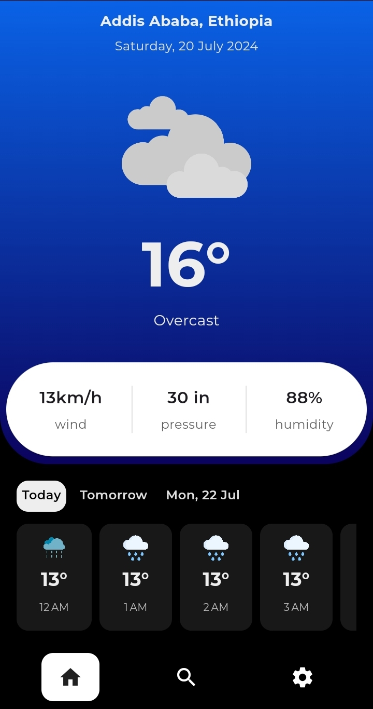
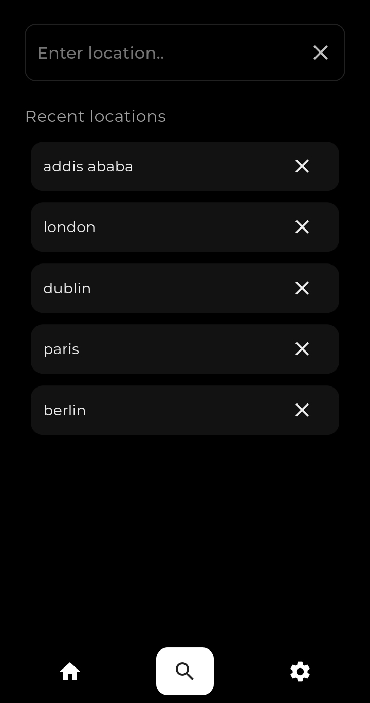
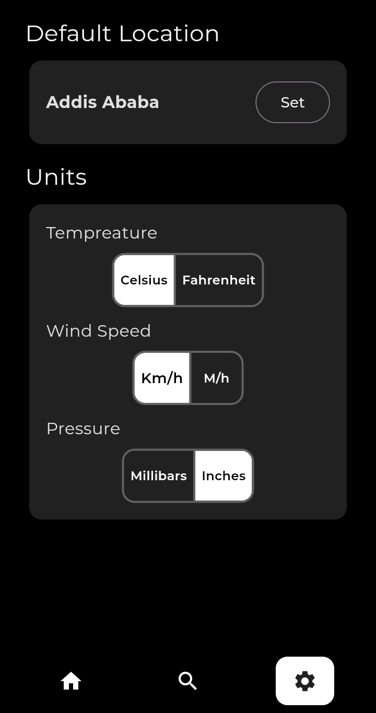

# Sky View

## Overview
Sky View is a weather app built with Flutter. This app allows users to check the current weather for their location or any city they search for. It displays temperature, weather conditions, and other relevant data.

## Features
- Display current weather based on user's location
- Search for weather in any city
- Show temperature, weather conditions, and other weather data
- Hourly weather forecast

## Screenshots

  
  
  

## API
This app uses the [WeatherAPI.com](https://weatherapi.com) to fetch weather data. You will need to get an API key from WeatherAPI.com and add it to your project.
